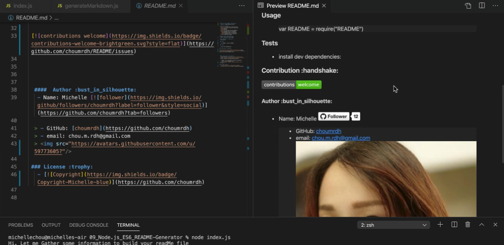

  # Project Title: 09_Node.js_ES6_README-Generator :raised_hands:
  - This is a command-line application that generate a ReadMe.md from user input.:bulb: 

  ## Table of Contents:
  - [User Story](#user-story-speech_balloon)
  - [Installation](#installation-floppy_disk)
  - [Usage](#usage)
  - [Tests](#tests)
  - [Contribution](#contribution-handshake)
  - [Author](#author-bust_in_silhouette)
    - [Name](#author-bust_in_silhouette)
    - [GitHub](#author-bust_in_silhouette)
    - [Email](author-bust_in_silhouette)
  - [License](#license-trophy)
  
  ### User Story :speech_balloon:
  - As A developer, I want a README generator so that I can easily put together a README for a new project.
  
  ###  Installation :floppy_disk::
  
  > npm install 

  ### Usage
   
  > var 09_Node.js_ES6_README-Generator = require("09_Node.js_ES6_README-Generator")

  ### Tests
  - install dev dependencies:
  

 ### Contribution :handshake: 
 
  
  
 
  
  #### 	Author :bust_in_silhouette:
   - Name: Michelle 
  
  > - GitHub: [choumrdh](https://github.com/choumrdh)
  > - email: chou.m.rdh@gmail.com
  >
  
 ### License :trophy:
   

   ##### Example:
  > 

